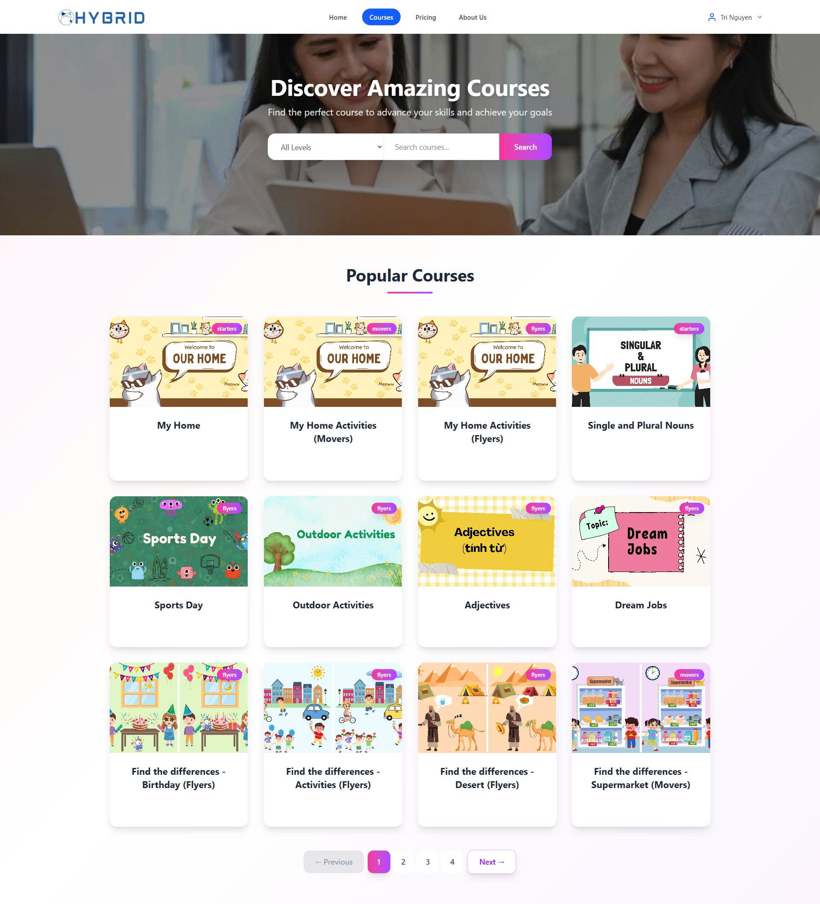

<!-- PROJECT LOGO -->

    

  <h3 align="center">HYBRID</h3>

  

    A web app for students to learn Cambridge programs and for teachers to create free mini-game templates to boost classroom engagement.
     
    <a href="https://hybrid-e-learn.netlify.app/"><strong>Explore our website »</strong></a>
     
  

<!-- TABLE OF CONTENTS -->

  
Table of Contents

  <ol>
    <li><a href="#about-the-project">About The Project</a></li>
    <li><a href="#built-with">Built With</a></li>
    <li><a href="#contributors">Contributors</a></li>
    <li><a href="#usage">Usage</a></li>
    <li><a href="#images">Images</a></li>
    <li><a href="#license">License</a></li>
    <li><a href="#contact">Contact</a></li>
  </ol>

<!-- ABOUT THE PROJECT -->
## About The Project

    

 
 
In today’s market, there is an overwhelming number of learning websites, yet many of them fall short in key areas. Most platforms lack diversity in learning formats, are not user-friendly for both students and teachers, and offer limited resources. Furthermore, they often do not integrate essential features like audio support — a critical element for language learning and interactive education. On top of that, the pricing models of these platforms are usually too expensive for the average Vietnamese user, creating a barrier to access quality education.

Therefore:
* Recognizing these limitations, our project was created to fill the gap. We are building an education platform specifically tailored for students following the Cambridge program and teachers in Vietnam who seek engaging and affordable teaching tools. The platform offers high-quality, localized content with a user-friendly design, audio-integrated materials, and a library of free, customizable mini-game templates. This empowers teachers to create fun, interactive lessons without technical hassle, while students enjoy a more dynamic and effective learning experience.

* Our goal is to provide a truly accessible and modern solution for Cambridge-based education in Vietnam — one that supports both educators and learners, and reflects the real needs of today’s classrooms.

(<a href="#readme-top">back to top</a>)

### Built With

This section should list any major frameworks/libraries used to bootstrap your project. Leave any add-ons/plugins for the acknowledgements section. Here are a few examples.

* 
* 
* 
* 
* 
* 
* 
* 

(<a href="#readme-top">back to top</a>)

## Contributors

## Usage
Actors
- **Administrator**
- **Student**
- **Teacher**

## Images
- **🏠HomePage**

- **🧠About Us Page**

- **🔐Login Page**

- **🙍‍♂️Profile Page**

- **💎Upgrade Tier Page**
  - Teacher  
    
  - Student  
    

- **📚Course Page**
  - Teacher  
    
  - Student  
    

- **📖Course Detail**
  - Teacher  
    
  - Student  
    

- **🎮Minigame Templates**
  
    
    

- **🛠Teacher Activities Page**

- **🛠Teacher Game Edit**

- **🧾Teacher Game Record**

- **🥇Student Play Game**
  
  

- **🗂Student Accomplishment Page**

- **✨Student Rating Game**

- **🖥Admin Dashboard**
  
  

- **💰PayOs Payment System Dashboard**

  

<!-- LICENSE -->
## License

Distributed under the Unlicense License. See `LICENSE.txt` for more information.

(<a href="#readme-top">back to top</a>)

<!-- CONTACT -->
## Contact

Nguyễn Huỳnh Minh Trí - triminh0502@gmail.com -   

Project Link: https://github.com/ToRiTheBlackCat/HYBRID_BE

(<a href="#readme-top">back to top</a>)

